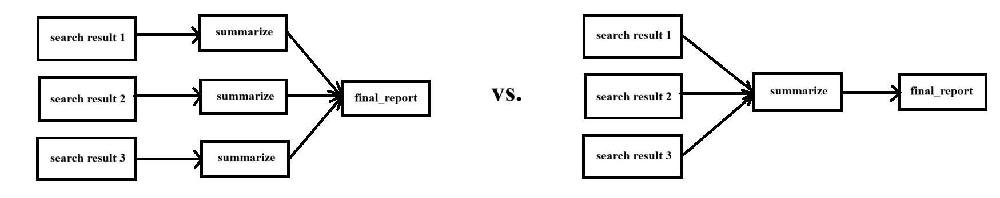

# Design Overview

This document describes my engineering process and design considerations from building this AI agent.

## Engineering Process and Considerations

### Initial Investigation of Existing Work

I ran existing deep research agents such as [open_deep_research](https://github.com/langchain-ai/open_deep_research) with prompts from the [Deep Research Bench](https://huggingface.co/spaces/muset-ai/DeepResearch-Bench-Leaderboard) to better understand expected input/output and project requirements.

From using [open_deep_research](https://github.com/langchain-ai/open_deep_research), I learned about the expected latency, how complex and detailed the input prompts might be, and the structure and level of detail expected for the output. This way, I can design my own agent to work in a similar way.

### Setting up the initial agent

I set up a basic LangGraph agent following instructions from the [Langchain Docs](https://docs.langchain.com/langsmith/local-server), which used the [new-langgraph-project-python](https://github.com/langchain-ai/new-langgraph-project) template.

I tried starting the Agent Server, but ran into errors due to conflicts when installing dependencies, so I decided to run it in a virtual environment similar to [open_deep_research](https://github.com/langchain-ai/open_deep_research).

Once I got the base template to run correctly, I could build my deep research agent on top of it by modifying `src/agent/graph.py` (the nodes and edges) and `src/agent/state.py` (fields in the agent state).

### Designing the agent structure

From the provided instructions, a simple deep research agent would need to take a research topic from the user, do web searches about the topic, and generate a report based on the web search results. 

#### Choosing the LLM model

I chose GPT-4.1 because its 1M-token context window makes it suitable for this use case where the model needs to process long prompts that include the content of entire web pages. According to [OpenAI’s model comparison chart](https://platform.openai.com/docs/models/compare), this context window is larger than those of GPT-5.2 and o4-mini.

A potential drawback of GPT-4.1 is the lack of reasoning capabilities. However, this is acceptable for my use case because each individual LLM call can be completed in a single step. The multi-step reasoning is already handled at the agent level through LangChain.

I chose the nano version of the model because it's the smallest version, making it cheaper and faster than the other versions. When I tested my agent with this version, it seemed powerful enough to generate high-quality results, so this version is sufficient. When I tried using larger models like GPT 4.1-mini and GPT 4.1, it didn't noticibly improve the results.

#### Choosing a search API

To obtain web search results, I chose Tavily as the search API because it is simple to integrate and returns clean, raw text content directly. For other search APIs, such as SerpAPI which only returns links and metadata, I would need to implement an additional content extraction step. Since extracting the main text content from HTML pages is non-trivial due to boilerplate, ads, and other noise, using Tavily allowed me to avoid this complexity. Not all search results from Tavily have raw content, so I added a filter to only keep the ones that do.

I explored Tavily's capabilities in the [API Playground](https://app.tavily.com/playground) and found that if I use the user's research topic as the search query directly, there would be many unrelated results. For example, the search query `Researching how the world's wealthiest governments invest.` would give results listing the richest countries in the world rather than only results that answer that research topic. This means the research topic needs to first be converted into a search query that is suitable for finding related results on the web.

#### Initial agent structure

My initial design of the agent had the structure: `query_generation` → `search_result_extraction` → `final_report`. The `query_generation` node took the user's research topic as input and outputted a search query. The `search_result_extraction` node took the search query as input and outputted a list of search results with raw content. Finally, the `final_report` node took the search results and generated a structured report.

When I tried running this, I found that the prompt to for the `final_report` node was very long, causing it to be slow, costly, and ignore some of the instructions about the report structure. This is because the content of the search results are often very long, consisting of thousands of words. I decided to add another node that could summarize the search results first before generating the final report. Thus, the structure of my deep research agent became: `query_generation` → `search_result_extraction` → `summarize` → `final_report`, where the `summarize` node took the raw content of the search results and outputted a much shorter summary in point-form.

#### Summarizing each result individually vs. Summarizing all results together

<div align="center">
  
</div>

One thing I needed to consider when designing the `summarize` node was whether to call the LLM for each search result and then combining the summaries, or combining the search results first and calling the LLM only once to summarize the combined results. 

The benefit of summarizing each result separately was that each LLM call would have a much shorter prompt, allowing the LLM to extract more details from the search result. Each instance of the `summarize` node could [run in parallel](https://docs.langchain.com/oss/python/langgraph/workflows-agents#orchestrator-worker) to reduce the latency. Additionally, it would be easy to match the title/url to the correct summary, making it possible for the final report to have in-line citations. The main drawback is that if there are a large number of search results to summarize, it would need to make a large number of LLM calls, making it computationally expensive.

The benefit of summarizing all results in one LLM call is that the summary will be shorter and more to-the-point compared to the previous method, allowing the prompt for the `final_report` node to be shorter and faster. The main drawback is that if I depend on the LLM to match the title/url to the summary, it would be less accurate.

In the end, I decided to summarize each result individually to allow accurate in-line citations and reduce latency through parallelization.

#### Extending the agent

I was inspired by the agent graphs of [open_deep_research](https://github.com/langchain-ai/open_deep_research) and [local-deep-researcher](https://github.com/langchain-ai/local-deep-researcher) to extend my agent with similar nodes and structure. After setting up the simple deep research agent, I decided to take it further by adding clarification and followup nodes to improve the performance. 

The clarification node could handle situations where the user's topic is too vague or missing context. For example, the prompt "`Should i use gpt4.1-mini or gpt4.1-nano?`" would cause the agent to ask clarification questions about the specific use case and criteria. This would allow the final report to be more focused and useful.

The followup node would check the summary of the search results to determine if the information is sufficient for writing the report, identifying knowledge gaps. It would generate a followup question to do further research on the topic. This allows the agent to do multiple rounds of searches. If there are knowledge gaps, it automatically searches for more information.

### Prompt Engineering Considerations

I created the prompts for each node with the help of ChatGPT. This helped make the prompts more thorough and detailed. I tested each prompt in a [Colab Notebook](https://colab.research.google.com/drive/1CPfDI-cpANEjX4aqq5Fw6o9rXv-GW87Y?usp=sharing) to make sure that there are enough requirements listed in the prompt to cover different cases and that the LLM output is structured correctly.

#### Query generation prompt

When designing the query generation prompt, I thought about how I would do research on the web and the types of queries I would write for different topics. For example, academic or scientific research topics should use queries for research papers. When the topic is a person, it should query for the LinkedIn or social media profiles and personal websites. For niche topics or community advice, I would add "reddit" to some of my queries. For software development projects, I would add "github" to my query. I used this to create rules in the prompt instructing the LLM to generate different queries for different types of topics.

I tested the query generation prompt to make sure that it considered the types of sources to search for.

- `video generation with diffusion models`: This prompt would generate queries for github repos and academic papers since it's related to software development projects and academic research.
- `john smith's work experience`: This prompt generated queries for LinkedIn and personal websites
- `how to tell the difference between female and male cats`: This generated queries for reddit and forums
- `do large language models exhibit cognitive biases analogous to humans?`: This generated queries for academic papers
- `how do retrieval-augmented generation systems compare to fine-tuning in low-data regimes?`: This also generated queries for academic papers

#### Summarizer prompt

For the summarizer prompt, I initially included the research topic and instructed the LLM to highlight information related to the research topic to tailor the summary to only take note of information useful for the final report. However, this caused the LLM to hallucinate summaries that don't actually use the information from the search result. I discovered this problem when I checked the summaries for situations where it failed to get search results that fit the research topic. Instead of generating notes from the search result, it generated notes related to the research topic that contained information not found in the search result.

For example, with the research topic:

```
I need to dynamically adjust Kubernetes (K8S) cluster node counts based on fluctuating business request volumes, ensuring resources are scaled up proactively before peak loads and scaled down promptly during troughs. The standard Cluster Autoscaler (CA) isn't suitable as it relies on pending pods and might not fit non-elastic node group scenarios. What are effective implementation strategies, best practices, or existing projects that address predictive or scheduled autoscaling for K8S nodes?
```

and the search result:

```
Global Fresh Mackerel price\nGet price analysis and market insights for Fresh Mackerel with Tridge.\nWholesale prices of Fresh Mackerel\nRecent wholesale prices\nOver the past 4 weeks, the global wholesale price of Fresh Mackerel generally ranged from $4.13 USD per kg to $4.19 USD per kg, or from $1.87 USD per pound (lb) to $1.90 USD per pound (lb).\n\nPeriod\nLow price, USD/kg  Low price, USD/kg\nLow price, USD/lb  Low price, USD/lb\nHigh price, USD/kg  High price, USD/kg\nHigh price, USD/lb  High price, USD/lb\n\nPast 4 weeks\n\nHistorical wholesale price trends\nThe global wholesale price of Fresh Mackerel has followed a downward trend over the past two years, influenced by evolving market conditions. In 2023, wholesale prices varied between $4.13 USD per kg and $6.43 USD per kg. However, by 2024, wholesale prices declined to a new range of $1.31 to $4.93 USD per kg, signaling reduced demand or increased supply for Fresh Mackerel...
```

it generated the summary:

```
- The standard Kubernetes Cluster Autoscaler (CA) relies on pending pods to trigger node scaling, which may not be suitable for non-elastic node groups or scenarios requiring proactive scaling.
- CA might not be effective in environments with predictable demand fluctuations, prompting the need for alternative strategies.
- Effective implementation strategies include scheduled autoscaling (predictive scaling based on known business cycles) and predictive autoscaling (using historical and real-time data to forecast demand).
- Best practices involve integrating external monitoring and forecasting tools to anticipate request volume surges before they occur, allowing preemptive resource adjustments.
- Existing projects and solutions for predictive or scheduled autoscaling for K8s include custom controllers, external autoscaling solutions, or using third-party tools that incorporate machine learning or time-series analysis.
- These approaches aim to proactively scale nodes up during expected peak loads and scale down during troughs, ensuring resource availability and cost efficiency.
- The focus is on understanding demand patterns and leveraging data-driven insights to optimize Kubernetes cluster size dynamically.
- Such strategies address limitations of CA by enabling more precise control tailored to business-specific request volume fluctuations.
```

From this example, we can see that the notes clearly do not use information from the search result, and was instead hallucinated based on the research topic.

To prevent this from happening, I removed the research topic from the prompt and only instructed the LLM to generate a summary of the search result without letting it know the research topic. This allows it to generate an accurate summary to make sure the final report only uses information from the search results instead of information hallucinated by the LLM.

#### Report generation prompt

For the report generation prompt, I made sure that it was able to generate a report with the correct structure and in-line citations. I used the output from [open_deep_research](https://github.com/langchain-ai/open_deep_research) as the guideline for how the reports should be structured and provided detailed instructions to the LLM:

```
Structure the report using the following sections:
Title
Executive Summary
- Briefly summarize the most important findings
Numbered Headings and Subheadings
- Organize findings into logical subsections
- Include supporting details and citations
Conclusion
- Summarize what the findings imply for understanding or decision-making
- Concise closing summary
Sources
- List referenced sources (URLs or source names) mentioned in the notes
- Each source should be formatted as: [<reference number>] <article title> - <url>
```

I also provided an example of the headings of the report to ensure that the LLM understood the structure and how to number the headings:

```
Example:
Executive Summary
1. Heading 1
1.1 Subheading
2. Heading 2
3. Heading 3
4. Conclusion
Sources
```

To make sure that the in-line sources corresponded to the correct search result, I added the title and url above each summary so the LLM would know which piece of information came from which source. For example:

```
Research notes:
Mackerel Market Size, Growth, Share, Trend and Forecast 2032 (https://www.credenceresearch.com/report/mackerel-market):
- The global mackerel market was valued at approximately USD 1,150 million in 2018, grew to USD 1,328.67 million in 2024, and is forecasted to reach USD 1,987.36 million by 2032, with a CAGR of 5.21%.  
- Market growth driven by increasing demand for affordable, nutritious seafood rich in omega-3 fatty acids, aligned with rising health awareness and healthy dietary trends.
...

Mackerel Market Size, Share & Trends (https://www.reanin.com/reports/mackerel-market):
- The Mackerel Market was valued at USD 1,129.13 million in 2024 and is projected to grow to USD 1,526.32 million by 2031, at a CAGR of 4.4%.  
- The market is highly concentrated with 1-5 major players but also exhibits fragmentation, indicating competition without dominant players.  
...
```

This allowed the in-line citations to use the number corresponding to the correct source the list of sources.

### Designing the agent state

I added the messages field to the agent state as required. This field uses a reducer so new messages returned by each node would be appended to the list of messages instead of overwriting.

I also added additional fields to the state for keeping count of the number of clarification and followup attempts to prevent endless loops, along with fields containing information to pass between the nodes, such as the list of generated queries, the list of search results, and the summaries.

At the end of the `final_report` node, I made sure to clear the fields by overwriting the lists with empty lists, setting strings to empty strings, and setting counters to zero. This would allow the agent to run with a fresh state for generating a new report.

## Shortcomings

### Latency

The agent take on average 30s to run. This is because it makes multiple LLM calls, which increases latency and cost. This could be improved by implementing a function that could extract only the main text content from the search results instead of all of the raw content.

Currently the raw content from the search results are long and noisy. With a program for extracting only the main text, it would shorten the content obtained from the search result, therefore shortening the summarizer prompts.

### LLM hallucination

Currently there aren't any mechanisms preventing the LLM from hallucinating data when generating the summaries or final report. Although I added requirements in the prompts instructing the LLM to only use information from the research notes, the LLM might ignore those instructions and still make up information.

One way to reduce hallucinations would be to call a verifier LLM after generating the final report. This LLM would verify that the report only used information from the research notes and rewrite the report to remove any hallucinations.

Another solution would be to develop a system where it would check each in-line citation in the generated report to find a semantic match in the corresponding search results to ensure that the information did come from the sources.

## Future Work

### Handling different types of research topics differently

When designing the query generation prompt, I instructed the model to generate different types of queries depending on the topic domain (eg. academic research versus community advice). This idea could be extended further by adapting additional parts of the agent’s pipeline to be topic-aware.

For example, the agent could include a dedicated routing node that uses an LLM to classify the topic into categories such as breaking news or academic research. Based on this classification, the agent would follow conditional edges to specialized sub-pipelines, each with search result extraction nodes tailored for that category.

#### Breaking News

For research topics about breaking news, the search results need to be recent. For example, the topic `what happened at the bondi beach shooting` would generate search queries such as `Victims and injuries Bondi Beach shooting news`. The search results from that query would contain different casualty counts since some results are not up-to-date. This would prevent the final report from containing the most accurate and up-to-date information. 

To fix this, the search result extraction node for breaking news topics would need to use the most recent results for each query, while it's fine for topics belonging to other categories to use older search results.

#### Academic Papers

If the user wants to use my deep research agent to help write an academic paper, they would only want to cite original research papers or official journal publications. Therefore the search results for this use case should be limited to only results from Google Scholar.

It's possible limit the results to certain domains with the Tavily API (setting the include_domains field to "https://scholar.google.com/") and the SerpAPI can search for results from Google Scholar. Instead of using the raw content from the search results, the search result extraction node would need to extract only the abstract of the paper.

This way, all of the sources for the generated report would come from the abstracts of existing research papers, aligning it with user expectations. There could be a flag in the config where the user could configure the agent to only include academic sources.

### Allowing followup prompts to edit a final report

Currently, after outputting the final report, if the user inputs another message, it would generate a new report using that message as the research topic. The deep research agent doesn't handle followup prompts if the user wants to make changes to the generated report.

To implement this functionality, there would need to be an LLM that determines whether the user's message indicates that they want to edit the existing report or create a new report. If the user wants to edit the report, there would be a new pipeline for either making changes directly to the final report or querying for additional information.

For example, the LLM handling the message `make the headings more descriptive` would take the existing report as input and rewrite the headings based on the user's message. On the other hand, a message such as `include more quantitative data` would cause the agent to query for additional search results containing the requested information before editing the report.

This would result in a much more complex agent graph with many different paths to handle different choices.
