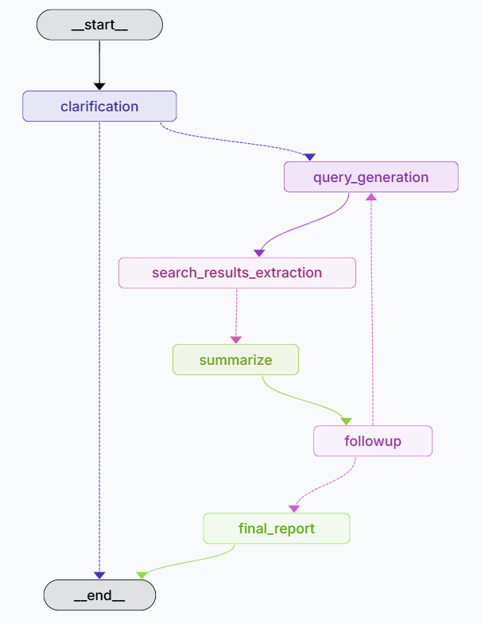
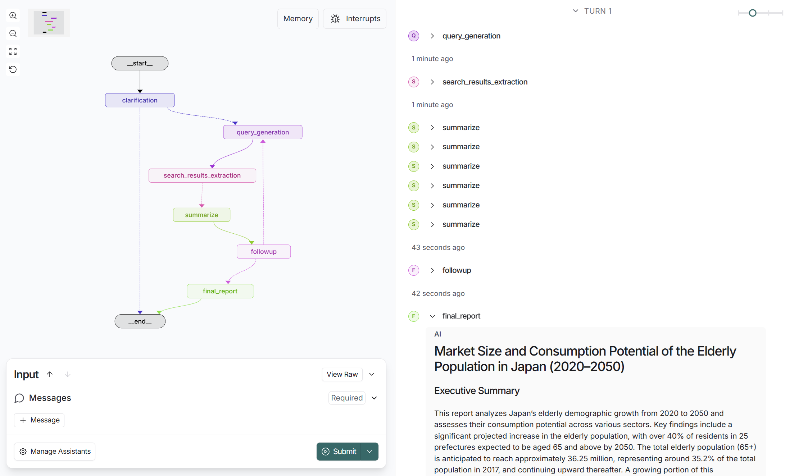
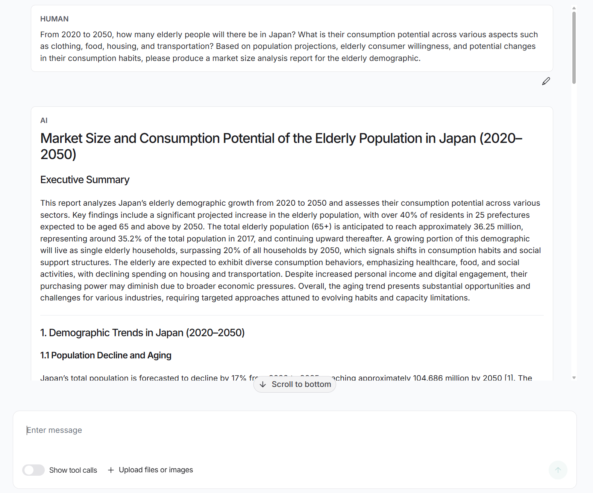

# Deep Research Agent

This is a simple deep research agent implemented with LangGraph, with clarification and follow-up capabilities. It uses OpenAI models (default: `gpt-4.1-nano`) and the [Tavily API](https://www.tavily.com/).

<div align="center">
  
</div>

The core logic defined in `src/agent/graph.py` which defines and compiles a graph with a messages field in state. The users can input their request in the messages, and the final report would be passed as an AI message.

`src/agent/config.py` contains agent settings and preferences that you can modify to change the LLM model used, number of searches, maximum number of clarification retries, maximum number of followup retries. Currently clarification and followup are disabled by default.

`src/agent/prompts.py` contains the system prompts used by the nodes in the agent graph.

`src/agent/state.py` defines the fields of the agent state, including the messages field, along with other helper fields.

`src/agent/utils.py` contains helper functions used by the nodes in the agent, such as calling the OpenAI API or the search API

## Quickstart

1. Clone the repository and activate a virtual environment:

```bash
git clone https://github.com/acyu123/DeepResearchAgent.git
cd DeepResearchAgent
uv venv
source .venv/bin/activate  # On Windows: .venv/Scripts\activate
```

2. Install dependencies

```bash
uv sync
# or
uv pip install -r pyproject.toml
```

3. Set up your .env file with the required API keys for Langsmith, OpenAI, and Tavily.

```bash
cp .env.example .env
```

4. Launch the agent with the LangGraph server locally:

```bash
# Install dependencies and start the LangGraph server
uvx --refresh --from "langgraph-cli[inmem]" --with-editable . --python 3.11 langgraph dev --allow-blocking
```

## Configuration

This agent uses LLMs for a few different tasks:

- Search Query Generation (default: `openai:gpt-4.1-nano`): Converts the user's research topic into search queries
- Summarization (default: `openai:gpt-4.1-nano`): Summarizes search API results
- Final Report Generation (default: `openai:gpt-4.1-nano`): Write the final report

You can modify the LLM model and other config settings in `src/agent/config.py`.

Currently the clarification and followup nodes are disabled by default. You can enable them in `src/agent/config.py` by setting `max_clarification_retries` or `max_followup_retries` to a positive number.

## Evaluation

This agent can be evaluated with [Deep Research Bench](https://huggingface.co/spaces/Ayanami0730/DeepResearch-Leaderboard), which is [available on LangSmith](https://smith.langchain.com/public/c5e7a6ad-fdba-478c-88e6-3a388459ce8b/d). 

To start the evaluation, run the following command:

```bash
# Run evaluation on the Deep Research Bench dataset (10 examples by default)
python tests/evaluate.py
```

This will provide a link to a LangSmith experiment where you can see the results. [See here](https://smith.langchain.com/o/3152abd8-898f-4c94-a02a-d5f6267af51b/datasets/a8131c65-7c18-48b7-849c-e6a02808c449/compare?selectedSessions=d4bc7629-5638-4b8c-89f5-b420c057db81) for the results from a previous run on a subset of 10 examples from the dataset.

By default, it will only evaluate on a subset of 10 examples from the dataset. You can change the `dataset_limit` in `tests/evaluate.py`.

## Example Output

- [Example Output](./static/example-output.md) for prompt:

```
From 2020 to 2050, how many elderly people will there be in Japan? What is their consumption potential across various aspects such as clothing, food, housing, and transportation? Based on population projections, elderly consumer willingness, and potential changes in their consumption habits, please produce a market size analysis report for the elderly demographic.
```

- [Example Output](./static/example-output2.md) for prompt:

```
What are the investment philosophies of Duan Yongping, Warren Buffett, and Charlie Munger?
```

## Screenshots

### Graph

<div align="center">
  
</div>

### Chat

<div align="center">
  
</div>

